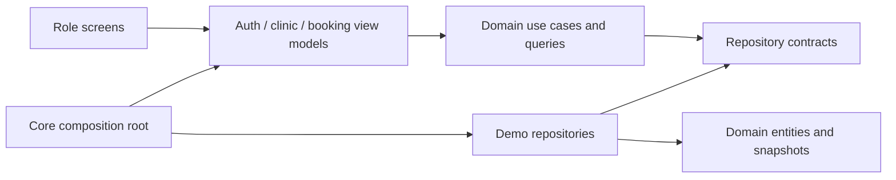

# Architecture after batch B2

The application uses a domain/data/presentation split with Riverpod view models. Each domain is independent of Flutter, Riverpod, storage formats and Firebase. Display labels, emoji and colors are presentation extensions on domain enums.



Arrows show source dependencies, rather than runtime network requests. Use cases invoke injected repository contracts at runtime; concrete implementations are selected in `core/providers/app_dependencies.dart`.

## Responsibilities

| Layer | Location | Responsibility |
| --- | --- | --- |
| Domain | `features/auth/domain`, `features/clinic/domain` | Entities, immutable snapshots, failures, repository contracts, authentication/registration/booking use cases, sorting/filtering and shared metrics |
| Data | `features/auth/data`, `features/clinic/data` | Isolated demo fixtures, auth/profile linkage, atomic in-memory mutations, snapshot streams, storage-schema mapping |
| Presentation | `features/*/screens`, `features/auth/presentation`, `features/clinic/presentation` | Render state; collect selections; call view-model actions; show progress, errors and retry; keep display-only labels/colors outside domain |
| Composition | `core/providers/app_dependencies.dart`, `core/providers/app_providers.dart` | Select/inject repositories, clocks and ID generators; create view models; expose immutable derived state to views |
| Routing | `routes/app_router.dart` | One owned router per provider container, refreshed by auth changes; shell/tab routing |

`AuthViewModel` depends on SignIn/RegisterUser/SignOut use cases. `ClinicViewModel` owns a repository subscription and refresh state, and ignores old refresh results if a newer stream event arrives. `BookingViewModel` prevents duplicate submission while awaiting the BookAppointment use case. The booking screen converts the selected display time into a DateTime, then supplies that selection; it no longer builds or inserts appointments.

Clinic repository reads and writes are asynchronous, so a future Firebase implementation can use the same contracts. All current adapters remain in memory. Async interfaces do not imply that Firebase is already implemented.

## Data and lifecycle

- Domain entities contain no serialization methods. `ClinicMapper` owns conversion for the current ISO-string/DateTime schema, rejects malformed records and unknown enum values, and requires an explicit user role. Firestore Timestamp conversion belongs to B6.
- Snapshots and nested entity collections copy and freeze their lists. Sorting produces a derived copy; widgets cannot mutate repository lists.
- Each demo repository owns a separate fixture snapshot and uses one injected seed time. Registration publishes a new snapshot; a patient appears in patient lists, and a doctor profile uses the new auth user's ID as `userId`.
- Doctor demo sign-in uses the profile's `userId`, rather than the appointment/profile `id`. Newly registered doctors are unavailable until their availability is configured.
- Demo credentials are simulated. Registered account identity/role is recovered from the demo record; selecting another role does not rewrite that record. `demo@mediflow.com` selects a seeded role account. No passwords are persisted by the demo adapter.
- Riverpod owns view-model, repository and router disposal. Auth view models ignore late completions after logout/disposal; booking models ignore late responses after disposal. Demo records persist within the container/session, including logout, and reset after application restart. Per-account filter/reset policy is still B3.

## Tests and boundary checks

```bash
dart run build_runner build
dart run tool/check_architecture.dart
dart format --output=none --set-exit-if-changed lib test tool
flutter analyze --no-pub
flutter test --no-pub
flutter build web --no-pub
```

Mockito mocks are generated from the two repository contracts in `test/mocks/repositories.dart`. Generated mocks are committed, so ordinary test runs do not require regeneration. Regenerate them whenever a repository signature changes.

Tests cover storage round trips/validation, immutable copies, repository isolation and updates, registration/profile relationships, use-case/repository interactions, auth loading/failure/stale completions, booking failures/duplicate submission, refresh races and disposal. Widget tests exercise startup, role sign-in/logout, actual selected-time booking through the repository, and loading/error/retry UI.

## Remaining work

Role route authorization and per-user visibility are B3: current read lists remain clinic-wide, and cross-role route rejection is not yet implemented. B4 adds doctor working-hours, conflict protection and appointment lifecycle/category rules. B5 replaces hardcoded chart series and completes management/payment flows. Localization, profile/availability controls, browser offline startup and responsive sign-off remain in their corresponding batches. Firebase adapters and security rules remain B6.

This architecture establishes dependency boundaries and tested state handling; it does not mark these remaining clinic workflows as complete.
