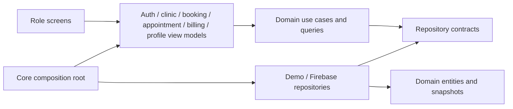

# Architecture

The application uses a domain/data/presentation split with Riverpod view models. Each domain is independent of Flutter, Riverpod, storage formats and Firebase. Display labels, emoji and colors are presentation extensions on domain enums.



Arrows show source dependencies, rather than runtime network requests. Use cases invoke injected repository contracts at runtime; concrete implementations are selected in `core/providers/app_dependencies.dart`.

## Responsibilities

| Layer | Location | Responsibility |
| --- | --- | --- |
| Domain | `features/auth/domain`, `features/clinic/domain` | Entities, immutable snapshots, failures, repository contracts, authentication/registration/booking/lifecycle use cases and policies, sorting/filtering, role-scoped visibility and shared metrics |
| Data | `features/auth/data`, `features/clinic/data` | Demo fixtures/mutations or Firebase SDK adapters, trusted profile sessions, role-scoped queries, callable commands, snapshot streams and storage mapping |
| Presentation | `features/*/screens`, `features/auth/presentation`, `features/clinic/presentation` | Render state; collect selections; call view-model actions; show progress, errors and retry; keep display-only labels/colors outside domain |
| Composition | `core/providers/app_dependencies.dart`, `core/providers/app_providers.dart` | Select/inject repositories, clocks and ID generators; create view models; expose immutable derived state to views |
| Routing | `routes/app_router.dart` | One owned router per provider container, refreshed by auth changes; shell/tab routing and authenticated role/path policy |

`AuthViewModel` depends on SignIn/RegisterUser/SignOut use cases. `ClinicViewModel` owns a repository subscription and refresh state, and ignores old refresh results if a newer stream event arrives. `BookingViewModel` prevents duplicate submission while awaiting the BookAppointment use case. The booking screen converts the selected display time into a DateTime, then supplies that selection; it no longer builds or inserts appointments.

Both repository implementations use the same asynchronous contracts. Demo mutations are atomic in memory. Firebase reads are scoped before downloading; mutations go through trusted callable transactions. `AuthoritativeReservations` is an optional capability because the backend validates conflicts against records the client cannot read. It supplies free instants and returns canonical reservations; the demo validates its full synthetic snapshot locally.

## Data and lifecycle

- Domain entities contain no serialization methods. `ClinicMapper` owns the demo ISO-string/DateTime schema. `FirebaseClinicMapper` handles Firestore Timestamp/callable UTC strings, trusted document IDs and strict enums, normalizing actual instants to Africa/Cairo without changing their epoch. Calendar-date selections are transmitted separately.
- Snapshots and nested entity collections copy and freeze their lists. Sorting produces a derived copy; widgets cannot mutate repository lists.
- Each demo repository owns a separate fixture snapshot and uses one injected seed time. Registration publishes a new snapshot; a patient appears in patient lists, and a doctor profile uses the new auth user's ID as `userId`.
- Doctor demo sign-in uses the profile's `userId`, rather than the appointment/profile `id`. Newly registered doctors are unavailable until their availability is configured.
- Demo credentials are simulated. Registered account identity/role is recovered from the demo record; selecting another role does not rewrite that record. `demo@mediflow.com` selects a seeded role account. No passwords are persisted by the demo adapter.
- Riverpod owns view-model, repository and router disposal. Auth view models ignore late completions after logout/disposal; booking models ignore late responses after disposal. Demo records persist within the container/session, including logout. Identity changes clear account search/specialty state and immediately rescope collection/metric providers. A confirmed demo reset invalidates auth identities, repositories and pending view models, restoring fixtures from one current clock; application restart does the same. Theme is an independent session preference; the UI language is English.

## Demo access policy

`RouteAccess` checks the active authenticated user's recorded role, not the login role selector. Anonymous/inactive users may visit only splash, onboarding, login and registration. Cross-role paths redirect to the account's home; query parameters do not change access.

All collection/metric providers consumed by screens derive from `ClinicAccess.scope`:

| Account | Visible demo data |
| --- | --- |
| Anonymous/inactive | No clinic records |
| Patient | Doctor directory, own patient record, appointments, prescriptions and invoices |
| Doctor | Own profile linked by `Doctor.userId`, own appointments/prescriptions, patients referenced by own appointments; no invoices |
| Admin | Complete synthetic clinic snapshot |

Missing or ambiguous doctor linkage returns an empty snapshot. Only the demo repositories hold the complete synthetic clinic. Client-side filtering is a demo visibility boundary. Firebase mode also scopes server queries and enforces reads in maintained rules; direct writes are denied to every client role. Callable commands derive identity/role from Firebase Auth and trusted user documents.

The login/registration screens explicitly describe simulated passwords and temporary identities; each portal carries a demo notice and a reset control. The shared demo email selects a seed role, while known emails retain their registered identity/role. No automatic session restoration or durable persistence is implemented for demo accounts.

## Reservation and lifecycle policy

- The next 14 dates offer future 30-minute slots aligned to each active doctor period. A visit may end exactly at closing. Invalid/reversed/overnight periods and UTC booking selections fail closed; the demo uses device local wall-clock times. Time-sensitive presentation refreshes every 30 seconds without reseeding repositories, while writes check the current clock again.
- Pending, confirmed and in-progress appointments reserve intervals. Both doctor and patient conflicts are checked, including partial overlaps and appointments with different doctors. Demo validation/write runs without an intervening await. Backend reservations require equivalent transactional checks and authoritative timezone conversion in B6; client checks are insufficient.
- Booking retries reuse a request ID for the same doctor/time/trimmed reason. Identical retries acknowledge the original record without another mutation; changed details cannot reuse the ID. Doctor cards pass profile IDs into the booking URL. Invalid/stale selections disable submission; success routes to patient appointments for direct URL and directory entry.
- Patients may cancel their own pending/confirmed visit strictly before its start. Associated doctors and admins may confirm pending visits up to the start, start confirmed visits at or after the start, and complete in-progress visits. Staff may cancel pending/confirmed visits, including overdue ones; no-show is available for pending/confirmed visits at or after the scheduled end. A late confirmed visit may still be started by staff. Terminal states cannot be reopened.
- The repository checks ownership and expected current status before applying a transition. Concurrent stale commands fail with a refresh message. UI actions ask for confirmation and publish through the stream; view models lock duplicate submissions and discard results after disposal/account reset. Admin can manage all appointments at `/admin/appointments`.
- Upcoming means in-progress visits or pending/confirmed visits starting at/after now. History is the complement, including future terminal records and overdue pending/confirmed visits. The categories are exhaustive/disjoint, and completed counters count the completed status only.
- Status changes do not create/refund/pay invoices. Billing is handled through separate explicit commands. Seed fixtures choose valid working periods on every weekday and retain consistent relative future/past direction; tests cover midnight and year rollover.

## Tests and boundary checks

```bash
dart run build_runner build
dart run tool/check_architecture.dart
dart format --output=none --set-exit-if-changed lib test tool
flutter analyze --no-pub
flutter test --no-pub
flutter build web --no-pub
```

Mockito mocks are generated from the two repository contracts in `test/mocks/repositories.dart`. Generated mocks are committed, so ordinary test runs do not require regeneration. Regenerate them whenever a repository signature changes.

Tests cover storage round trips/validation, immutable copies, repository isolation and updates, registration/profile relationships, use-case/repository interactions, auth loading/failure/stale completions, booking failures/duplicate submission, refresh races and disposal. Widget tests exercise startup, registration and role retention, all portal paths for each role, anonymous redirects, sign-in/logout, reset confirmation/cancellation, actual selected-time booking through the repository, and loading/error/retry UI. The route matrix now includes the admin appointment page (15 portal paths). Provider tests switch several identities against the same underlying clinic and verify scoped records/metrics, cleared reads and stale-result isolation after reset.

## Remaining work

B5 implements source-derived charts, billing and profile/availability management; B6 connects the optional Firebase implementation. Browser offline startup, responsive/platform sign-off, branding and CI remain B7. The interface is intentionally English-only; no real payment gateway or medical-record upload flow is claimed.

This architecture establishes dependency boundaries and tested state handling; it does not mark these remaining clinic workflows as complete.

## Analytics and display conventions

`ClinicAnalytics` derives six payment-month buckets in integer cents, all-time fully paid invoice totals, complete specialty counts and the four most recently updated appointments from the scoped snapshot. Partial/refunded invoices are excluded, and malformed or future-dated paid records are flagged. This is a snapshot of settled invoices, not a transaction ledger. The doctor portal exposes completed-visit fees without implying collection. `AnalyticsCharts` renders these immutable series with dynamic axes and explicit empty states. `ClinicFormatters` supplies USD values and grapheme-safe avatar initials.

## Demo billing commands

`IssueAppointmentInvoice` and `RecordInvoicePayment` require an active admin. The repository revalidates them against its latest snapshot and clock, issues at most one consultation-only invoice per completed visit, and atomically publishes invoice/linked-appointment payment changes. `BillingPolicy` checks cent precision, item/tax/discount arithmetic, dates and allowed full-settlement/full-refund transitions; an expected-status check protects competing writes. `BillingViewModel` owns submission/error state and ignores disposed completions. Billing is a fictional status-recording workflow; partial balances and a cash-flow ledger are not implemented.

## Profile management

`ManageProfiles` supplies patient/doctor save and safe-delete use cases. `ProfilePolicy` validates contacts, cent-precision fees, experience and non-overlapping same-day working periods. Owners edit their profile; active admins add doctors, edit/deactivate patients, and delete only profiles with no clinic record references. Edits compare the original editable fields against current values, protecting concurrent forms even with a fixed clock. Identity/email and stored appointment/invoice names/fees stay unchanged. Availability edits must retain future reserved slots; disabling new bookings does not cancel visits.

`ProfileViewModel` owns submission/error/disposal handling; forms collect input and invoke it. The demo auth adapter reads current clinic records; its composition listens to successful clinic snapshots to update or revoke a session. Firebase instead owns an independent server-confirmed user-document subscription, so restoring auth does not depend on loading protected clinic records. Identity/role changes clear the clinic scope and reject pending results; read failures clear visible data before safe error feedback. Refresh restarts failed subscriptions.

The composition root explicitly selects the mode. The default does not initialize Firebase. Invalid explicit Firebase configuration renders a startup error; there is no silent demo fallback. Backend login has no role selector and registration creates patients only. Password recovery uses a use case and presentation view model. Portals have no entry/exit animation, preventing duplicate navigator keys when a trusted session restores before an old transition ends. Branch navigation retains its own stacks.

Firestore watches combine separately authorized queries into one view snapshot. Their events can arrive separately after a server transaction, so the client snapshot is an eventual view rather than a database-wide transaction read. Billing commands still update invoice/visit records atomically on the server. Analytics reevaluate the current clock when a record arrives, retaining its normalized clinic month rather than converting it to the device timezone.
